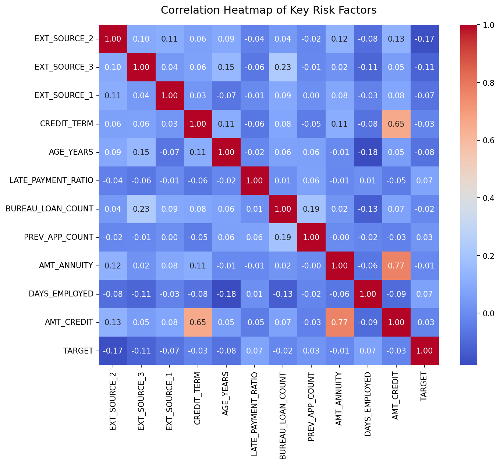
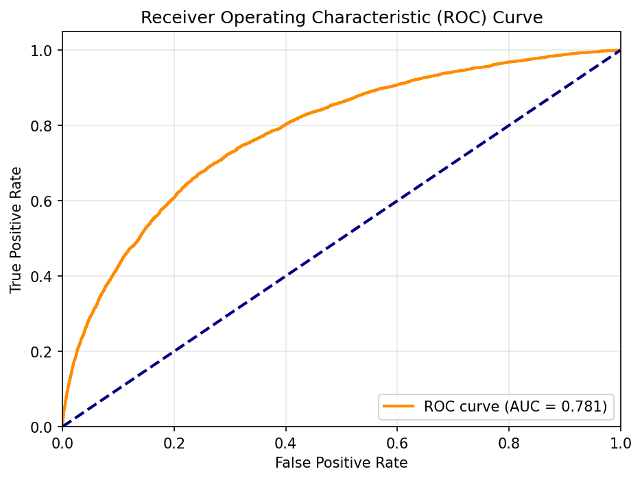
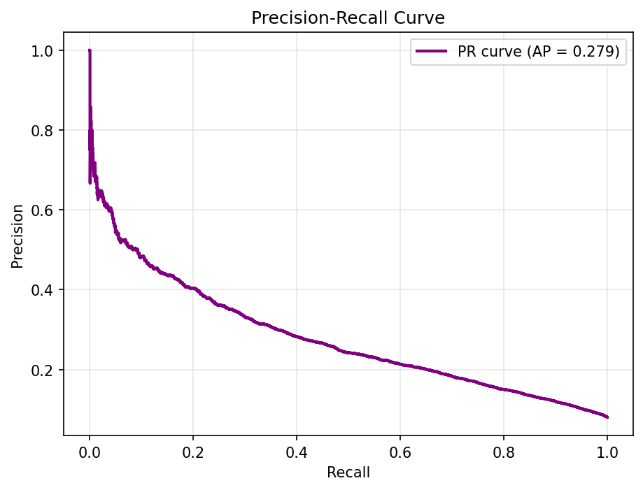
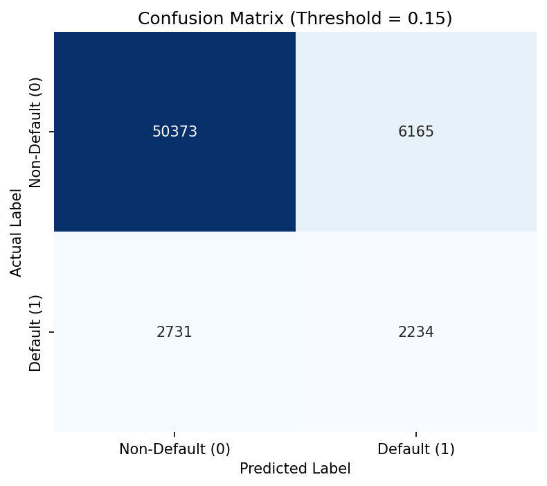
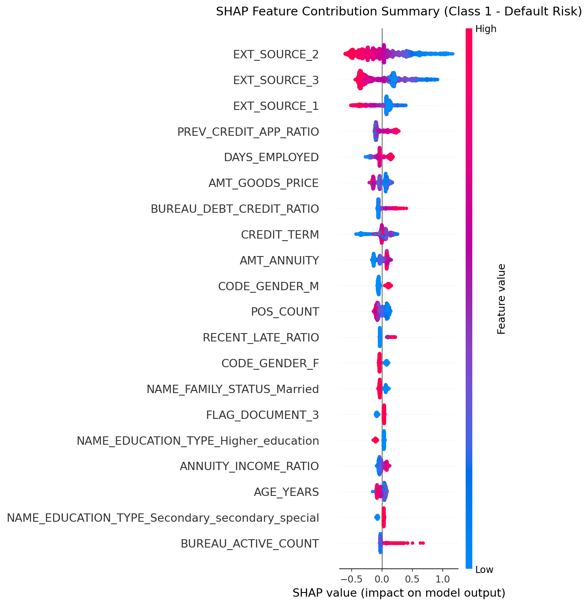
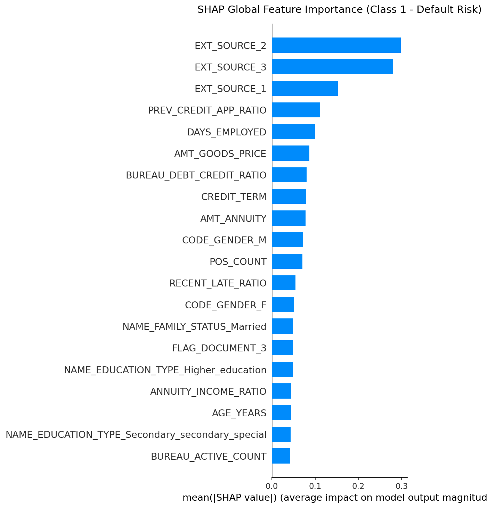

# Credit Risk Prediction ML Pipeline

An end-to-end, production-grade machine learning pipeline for predicting loan default using the Home Credit Default Risk dataset. This project processes raw financial datasets, engineers advanced aggregations and interaction terms, runs automated feature selection, tunes gradient-boosted ensembles, and provides model explainability via SHAP.

---

## 1. Project Overview & Problem Statement

In consumer lending, predicting the probability of loan default is critical. Financial institutions must balance two competing risks:
1. **Credit Risk (Type I Error / False Negative):** Approving a borrower who will default, leading to direct write-off losses.
2. **Opportunity Loss (Type II Error / False Positive):** Rejecting a creditworthy borrower, leading to lost interest revenue.

**Goal:** Develop a robust binary classifier to predict `TARGET` (0 = Repaid, 1 = Default / Payment Difficulties) and optimize the classification threshold to maximize business profitability.

---

## 2. Dataset & Structure

The pipeline uses the public **Home Credit Default Risk** dataset, which consists of multiple relational tables:
- **`application_train/test`:** Main application details (income, credit amount, annuities, family status, etc.).
- **`bureau` & `bureau_balance`:** Historical credit bureau data for active/closed loans outside Home Credit.
- **`previous_application`:** Previous applications for Home Credit loans.
- **`installments_payments`:** Detailed installment payment history for previous loans.
- **`POS_CASH_balance` & `credit_card_balance`:** Monthly credit card and point-of-sale loan balance histories.

### Data Characteristics
- **Observations:** 307,511 loans (in training set).
- **Target Imbalance:** Highly imbalanced (~91.8% repaid, ~8.2% default).
- **Features:** Over 120 raw variables, expanded to **215+** via advanced feature engineering.

---

## 3. Machine Learning Pipeline Architecture

The workflow is structured into 4 sequential, highly reproducible Jupyter notebooks:

```
    Business Understanding & EDA
                 ↓
    Data Cleaning & Feature Engineering
                 ↓
        Feature Selection (L1 + Tree + RFE)
                 ↓
    Model Training & Tuning (CatBoost/LightGBM/XGBoost)
                 ↓
      Threshold Optimization & SHAP Explainability
```

---

## 4. Pipeline Walkthrough

### [01. Business Understanding & EDA](notebooks/01_BusinessUnderstanding_EDA.ipynb)
- Outlines the commercial lending objectives and key metrics.
- Examines class imbalance, missing value profiles, and numeric distributions.
- Identifies important anomalies (e.g., `DAYS_EMPLOYED` value `365243` representing missing values).

### [02. Data Cleaning, Feature Engineering & Feature Selection](notebooks/02_DataCleaning_FeatureEngineering_FeatureSelection.ipynb)
- **Data Cleaning:** Imputes missing values with robust median values and flags employment anomalies.
- **Advanced Aggregations:** Computes customer-level aggregations from transactional tables (POS Cash, credit card utilization, installment delays, and bureau delinquency trends).
- **Interaction Engineering:** Creates critical interaction features including `EXT_SOURCE_MEAN`, `CREDIT_INCOME_RATIO`, and `CREDIT_TERM`.
- **Feature Selection:** Filters the 215+ candidate features using 4 methods:
  1. *Correlation Analysis* (target correlation >= 0.02)
  2. *XGBoost feature importance* (top 90% cumulative importance)
  3. *Recursive Feature Elimination (RFE)* using Logistic Regression
  4. *Lasso (L1) Regularization* (non-zero coefficients)
  - *Result:* Keeps features selected by **at least 2 of the 4 methods** to create a robust, generalized feature set.
- **Dimensionality Reduction:** Evaluates PCA (Explained Variance) and LDA separation boundary.

### [03. Model Training & Tuning](notebooks/03_ModelTraining.ipynb)
- Splits data into an 80/20 train/test split.
- Compares baseline models: Logistic Regression, Random Forest, XGBoost, LightGBM, and CatBoost.
- Tunes hyperparameters for the top boosting models using `RandomizedSearchCV`.
- **Dynamically selects the best model** (ranked by cross-validated ROC-AUC) and fits it on the entire training set.

### [04. Model Evaluation & Explainability](notebooks/04_ModelEvaluation_Explainability.ipynb)
- Computes ROC and Precision-Recall curves.
- **Threshold Optimization:** Scans probability cutoffs to maximize the F1-score, shifting the classification threshold from the default `0.50` to `0.15` to account for class imbalance.
- Explains model predictions locally and globally using **SHAP** beeswarm and bar plots.
- Summarizes business insights and underwriting recommendations.

---

## 5. Model Performance & Results

### Baseline vs. Tuned Model Comparison (5-Fold Cross-Validation)

| Model | Baseline ROC-AUC | Tuned ROC-AUC |
| :--- | :--- | :--- |
| **CatBoost** | 0.747 | **0.769** |
| **XGBoost** | 0.745 | 0.765 |
| **LightGBM** | 0.743 | 0.761 |
| **Random Forest** | 0.713 | — |
| **Logistic Regression** | 0.706 | — |

*CatBoost was dynamically selected as the best overall model.*

### Final Holdout Test Evaluation (Optimized Threshold = 0.15)

| Metric | Score | Note |
| :--- | :--- | :--- |
| **ROC-AUC** | **0.781** | Strong discriminative capability |
| **Precision** | 0.266 | Low false-alarm impact |
| **Recall** | **0.450** | Catches 45% of actual defaulters (up from ~7% at threshold 0.50) |
| **F1 Score** | 0.334 | Optimal balance for imbalanced target |

---

## 6. Visualizations

The pipeline automatically exports publication-quality plots to the `images/` directory:

### Correlation Heatmap of Risk Factors


### ROC & Precision-Recall Curves



### Confusion Matrix (Threshold = 0.15)


### SHAP Explainability & Feature Importance



---

## 7. Key Business Insights

1. **Credit Bureau Integration is Crucial:** The external credit risk scores (`EXT_SOURCE_1`, `EXT_SOURCE_2`, `EXT_SOURCE_3`) are the most powerful predictors of default. Underwriters should prioritize credit bureau integration.
2. **Repayment delays are early warnings:** Variables like `LATE_PAYMENT_RATIO` and `MAX_PAYMENT_DELAY` are strong signals of delinquency. Customers with late payment frequencies > 15% should face credit limits reduction.
3. **Debt-to-Income Term constraints risk:** Ratios such as `CREDIT_TERM` (annuity-to-credit ratio) and `CREDIT_INCOME_RATIO` capture credit risk significantly better than raw values, demonstrating the effectiveness of feature engineering.

---

## 8. Installation & Usage

### Prerequisites
Make sure Python (>= 3.9) is installed.

### Setup Environment
1. Clone the repository:
   ```bash
   git clone https://github.com/your-username/home-credit-default-risk.git
   cd home-credit-default-risk
   ```
2. Create and activate a virtual environment:
   ```bash
   python -m venv .venv
   source .venv/bin/activate  # On Windows: .venv\Scripts\activate
   ```
3. Install dependencies:
   ```bash
   pip install -r requirements.txt
   ```

### Download Dataset
1. Download all dataset files from [Kaggle](https://www.kaggle.com/competitions/home-credit-default-risk/data).
2. Place all CSV files directly inside the `data/` folder.

### Run Pipeline
Compile the notebooks using the build scripts, and then open Jupyter Lab/Notebook to run them sequentially:
```bash
# Compile Python scripts into Jupyter Notebooks
python build_nb01.py
python build_nb02.py
python build_nb03.py
python build_nb04.py
```
After compilation, open Jupyter to run the notebooks under the `notebooks/` directory.

---

## 9. Future Work
- **Ensemble Stacking:** Build a meta-estimator combining CatBoost, XGBoost, and LightGBM predictions.
- **API Deployment:** Develop a FastAPI microservice to expose the model for real-time risk assessments.
- **Model Monitoring:** Implement concept drift tracking using libraries like Evidently.
